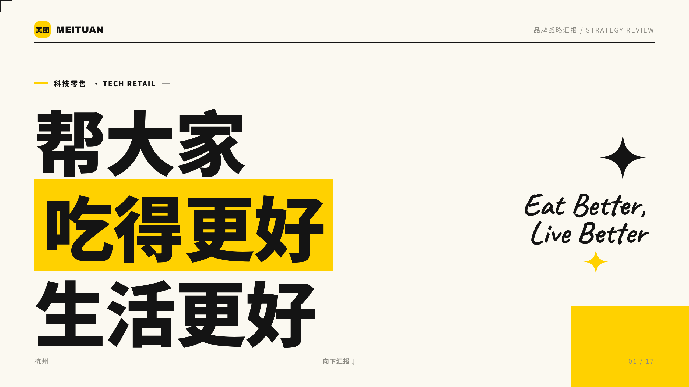
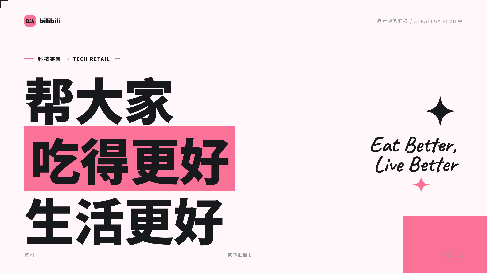
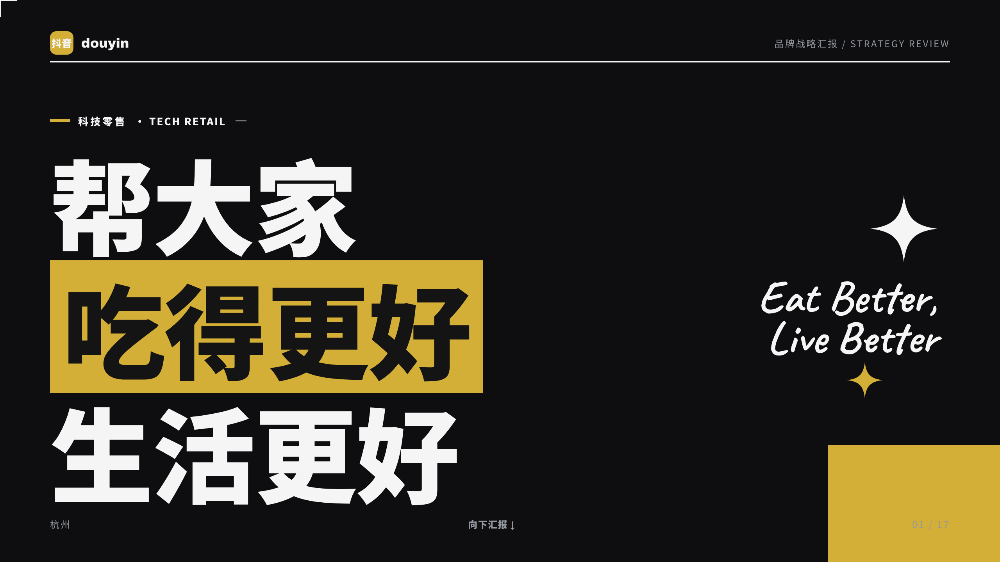
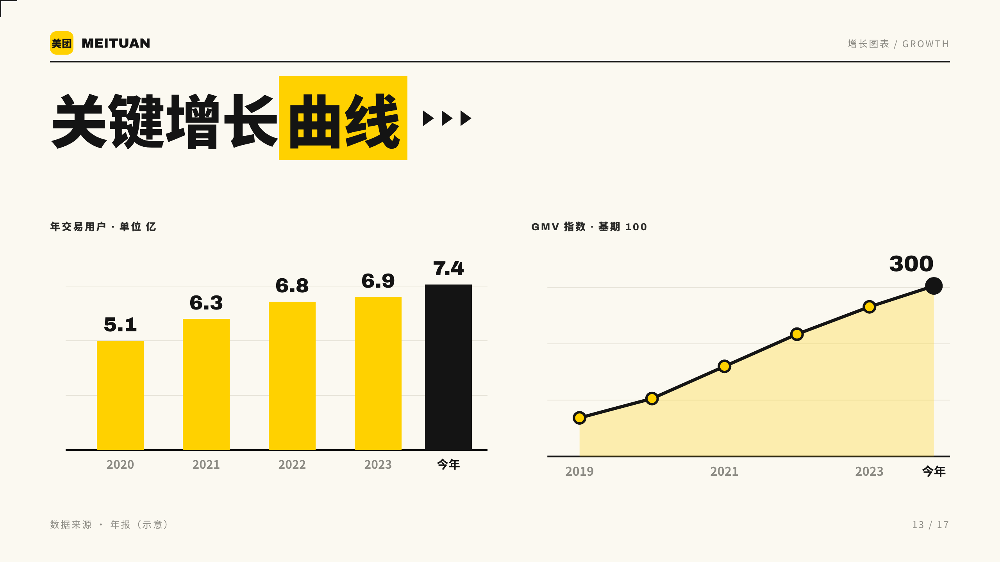
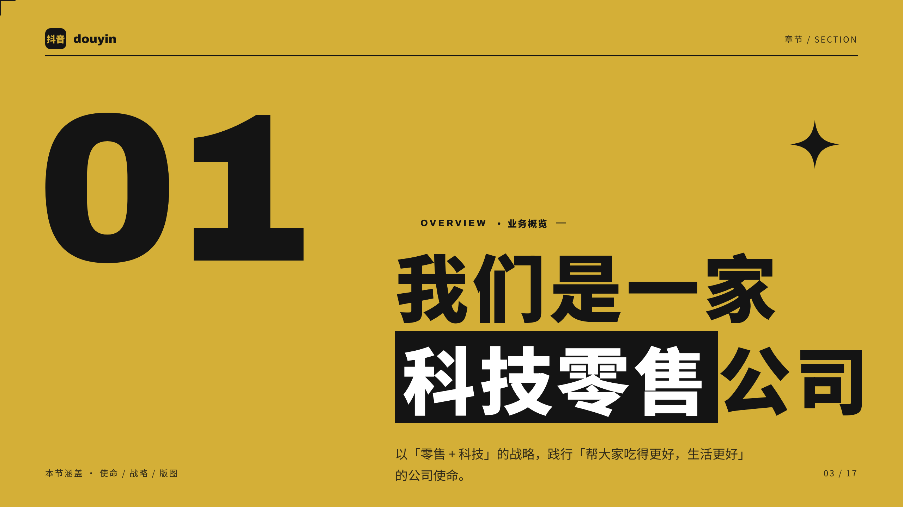
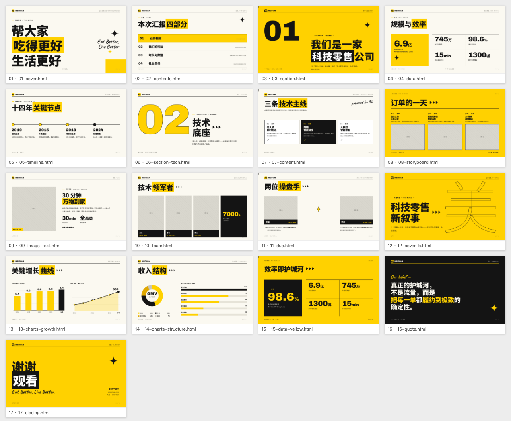

# 大厂编辑风 · 可换肤 Deck System

一套「**皮肤（品牌 VI）与骨架（版式 + 内容）分离**」的高设计感 PPT 系统。骨架是大厂编辑风的杂志式版式（巨型标题、色块高亮、编号章节、黑白照拼贴、纯 SVG 图表、手写体点缀），皮肤是各公司品牌 VI。

**HTML 是设计母本**，用无头 Chrome 渲染，一键导出 **PDF（矢量）** 与 **PPTX（每页全铺高清图，100% 保真）**。默认皮肤：美团黄黑。

## 同一套骨架，一键换皮

| 美团黄黑（默认） | B站粉 | 抖音黑金（深色皮肤） |
|---|---|---|
|  |  |  |

只改了 `theme.css` 一个文件，logo / 主色 / 页底 / 图表 / 细节整体换皮：

| 图表也跟随主题 | 深色皮肤主色底页 |
|---|---|
|  |  |

## ✨ 核心：换公司 = 只改一个文件

换品牌只需编辑 [`slides/theme.css`](slides/theme.css)，17 页 + 图表 + 星芒 + 角标细节整体换皮：

```css
--brand-primary: #FB7299;    /* 主色（美团黄 / B站粉 / …）*/
--brand-ink:     #18191C;    /* 墨色 */
--brand-bg:      #FFF7FA;    /* 页底 */
--brand-chart-3, --brand-chart-4;   /* 图表辅助色 */
--font-display, --font-cjk, --font-script;  /* 字体 */
--brand-logo-cn: "B站";  --brand-logo-en: "bilibili";  /* 徽标中英文 */
```

已内置示例皮肤：[`themes/meituan.css`](themes/meituan.css)（默认黄黑）、[`themes/bilibili.css`](themes/bilibili.css)（B站粉）。

> **皮肤 vs 内容**：颜色 / 字体 / logo 由 `theme.css` 自动全局换皮；页面标题 / 数据 / 正文属于「内容」，随每份 deck 重写。

## 17 种版式原型

封面 · 目录 · 章节页（编号 / 描边两版）· 三栏卡片 · 数据网格 · 满黄数据 · 时间轴 · 分镜/流程 · 图文案例 · 团队卡 · 双人物 · 金句 · **柱状+折线图** · **环形+排名图** · 结束页。全部在 [`slides/`](slides/)，直接复制改写。

## 快速开始

```bash
# 预览（本地服务器 + 放映器：←/→ 翻页，F 全屏）
python3 -m http.server 4507
# 浏览器打开 http://localhost:4507/index.html

# 导出 PDF（矢量）
python3 scripts/build_pdf.py            # → out/deck.pdf

# 导出 PPTX（需 pip install python-pptx）
python3 scripts/build_pptx.py           # → out/deck.pptx

# 生成「双击即用」的自包含单文件 + 单页（内联 CSS，零外部依赖）
python3 scripts/bundle_html.py          # → out/美团样册-单文件.html, standalone/*.html
```

导出脚本自动探测本机 Chrome / Chromium，无需服务器，并会在导出前**自动刷新页码**（`renumber.py`），加页/删页/换序都不用手动改。

## 换肤示例

```bash
# 方式一：套用现成示例皮肤
cp themes/bilibili.css slides/theme.css        # B站粉 / themes/douyin.css 黑金

# 方式二：一条命令生成皮肤（辅助色自动从主色推导）
python3 scripts/reskin.py --primary "#FB7299" --logo-cn "B站" --logo-en "bilibili"

# 深色皮肤（黑金，用哑光金属金而非亮黄，更有奢华感）+ 顺带替换正文里的旧品牌名
python3 scripts/reskin.py --primary "#D4AF37" --dark \
    --logo-cn "抖音" --logo-en "douyin" --rename "美团=抖音" --rename "MEITUAN=douyin"

# 真实 logo 图片（而非文字方块），base64 直接内嵌进 theme.css
python3 scripts/reskin.py --primary "#FB7299" --logo-en "bilibili" --logo-image ./logo.png

# 然后刷新产物
python3 scripts/bundle_html.py && python3 scripts/build_pptx.py && python3 scripts/build_pdf.py
```

`reskin.py` 生成后会自动跑 **WCAG 对比度自检**，配色太糊（比如浅主色配白底）会打印警告并给出实际比值。

## 拼稿子的辅助工具

```bash
# 换页顺序：先导出当前顺序清单，编辑排序后一次性重排+重编号（不用手动 mv 文件名）
python3 scripts/assemble.py --write-current    # → slides/outline.txt
python3 scripts/assemble.py                    # 按编辑后的顺序重排

# 溢出检测：文案改长了容易被画布裁切，肉眼很难查，这个自动找出来
python3 scripts/check_overflow.py

# Contact sheet：全套 17 页缩略图拼成一张网格图，几秒看完整套
python3 scripts/contact_sheet.py                # → out/contact-sheet.png
```



> 支持**浅色 / 深色**两类皮肤：`--dark` 会把墨色转浅、页底转深，主色底页的文字自动保持可读（`--brand-on-primary`）。

## 目录结构

```
├─ SKILL.md                技能入口（Claude Code skill）
├─ index.html              放映 / 浏览器
├─ slides/
│  ├─ theme.css            ★ 皮肤：品牌 token / 字体 / logo（换肤只改这个）
│  ├─ deck.css             骨架引擎：全部版式，只引用 var(--brand-*)
│  └─ NN-*.html            17 种版式原型
├─ themes/                 示例皮肤（meituan / bilibili / douyin 黑金）
├─ scripts/
│  ├─ reskin.py            一键生成皮肤（主色/logo图片 + 公司名 → theme.css，含对比度自检）
│  ├─ assemble.py          声明式排序：编辑 outline.txt 一次性重排+重编号
│  ├─ renumber.py          按文件顺序自动刷页码
│  ├─ check_overflow.py    溢出检测：找出超出画布的元素
│  ├─ contact_sheet.py     全套缩略图网格（一眼看全）
│  ├─ bundle_html.py       内联 CSS 的自包含 HTML
│  └─ build_pdf.py / build_pptx.py
├─ docs/preview/           README 预览图
└─ reference/design-spec.md  设计规范细则
```

## 设计规矩（保持一致）

- 每页只保留**一个视觉焦点**，其余压成小字注释
- 主色克制：一页里主色块 ≤ 2 处，只主色 + 墨 + 白
- 中文标题思源黑 Heavy(900)，行高 ~1.12
- 新页只用 `var(--brand-*)` 和 `.f-*/.s-*` 工具类，**绝不写死品牌 hex**，否则换肤会漏

## 依赖

- Google Chrome / Chromium（渲染导出）
- Python 3；`python-pptx`（仅 PPTX 导出需要）
- 字体走 Google Fonts（Archivo / Noto Sans SC / Caveat），离线自动回退系统字体
